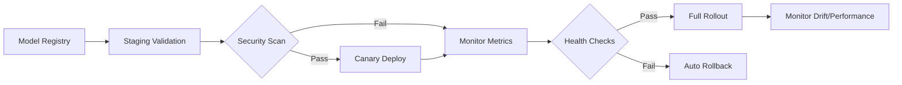

# AI Product Deployment

Deploying AI products requires orchestrating model artifacts, infrastructure, monitoring, and security across diverse environments. This concept provides a structured approach to deployment decisions spanning cloud, on-premise, and hybrid topologies.

## Deployment Topologies

| Topology | Description | Latency | Data Gravity | Compliance | Ops Complexity |
|----------|-------------|---------|--------------|------------|----------------|
| **Cloud-Native** | Model served from managed cloud (Vertex AI, SageMaker, Azure ML) | Low (regional) | Data in cloud | Shared responsibility | Low (managed) |
| **On-Premise** | Model served on own hardware (K8s, bare metal) | Lowest (local) | Data stays local | Full control | High (self-managed) |
| **Hybrid (Cloud + Edge)** | Heavy training in cloud; inference at edge/on-prem | Lowest (edge) | Data local for inference | Selective | High (sync) |
| **Serverless Functions** | Model as FaaS (Cloud Functions, Lambda, Cloud Run) | Variable (cold start) | Data in cloud | Shared responsibility | Lowest (auto-scale) |

[^r-cloud-infrastructure][^r-on-premise-infrastructure][^r-software-system]

## Model Serving Patterns

| Pattern | Description | Latency | Throughput | Complexity |
|---------|-------------|---------|------------|------------|
| **REST/gRPC API** | Model wrapped in HTTP/gRPC service | Medium | High | Medium |
| **Batch Inference** | Scheduled jobs, async results | High (min-hrs) | Very High | Low |
| **Streaming Inference** | Kafka/Kinesis → model → output stream | Low (ms) | High | High |
| **Edge/On-Device** | Model runs on device (mobile, IoT, gateway) | Lowest | Limited | High (distribution) |
| **Feature Store + Online Inference** | Features fetched → model → response | Low (ms) | High | Medium |

[^r-software-system][^r-cloud-infrastructure][^r-on-premise-infrastructure]

## Deployment Pipeline Stages

### Stage Gates

| Gate | Criteria | Owner |
|------|----------|-------|
| **Model Registry** | Registered with metadata, lineage, metrics | ML Engineer |
| **Security Scan** | Vulnerability scan, secret scan, license check | Security |
| **Staging Validation** | Accuracy ≥ threshold, latency < SLA, bias < threshold | ML Engineer + PM |
| **Canary Deploy** | 1-5% traffic, error rate < 0.1%, latency p99 < SLA | ML Engineer + SRE |
| **Full Rollout** | Canary stable for 24h, no alerts | PM + SRE |

[^r-software-development-lifecycle][^r-security-control][^r-software-system]

## Infrastructure Decisions

| Decision | Cloud | On-Premise | Hybrid |
|----------|-------|------------|--------|
| **GPU/TPU** | Managed (A100, TPU v4) | Capital purchase, depreciation | Burst to cloud |
| **Orchestration** | Vertex AI, SageMaker, AKS/EKS/GKE | K8s (OpenShift, Rancher) | Anthos, Arc |
| **Model Registry** | Vertex Model Registry, SageMaker Model Registry | MLflow, custom | Federated |
| **Feature Store** | Vertex Feature Store, Feast | Feast, Hopsworks | Federated |
| **Monitoring** | Cloud Monitoring, Prometheus/Grafana | Prometheus/Grafana, Datadog | Unified |

[^r-cloud-infrastructure][^r-on-premise-infrastructure][^r-security-control]

## Security & Compliance

| Control | Cloud | On-Premise | Hybrid |
|---------|-------|------------|--------|
| **Encryption at Rest** | Managed (CMEK) | Self-managed (LUKS, BitLocker) | Both |
| **Encryption in Transit** | mTLS (managed) | mTLS (self-managed) | Both |
| **Access Control** | IAM (fine-grained) | RBAC (AD/LDAP) | Federation |
| **Audit Logging** | Cloud Audit Logs | SIEM integration | Unified |
| **Data Residency** | Region selection | Guaranteed local | Policy-based |

[^r-security-control][^r-cloud-infrastructure][^r-on-premise-infrastructure]

## Monitoring & Observability

| Signal | Metrics | Alerting |
|--------|---------|----------|
| **Performance** | Latency p50/p95/p99, throughput, error rate | SLA breach |
| **Model Health** | Prediction drift, feature drift, concept drift | Drift threshold |
| **Data Quality** | Missing values, schema drift, distribution shift | Threshold breach |
| **Infrastructure** | GPU utilization, memory, CPU, queue depth | Capacity threshold |
| **Business** | Conversion, revenue per prediction, user satisfaction | Anomaly detection |

[^r-software-system][^r-cloud-infrastructure][^r-on-premise-infrastructure]

## PM's Deployment Checklist

- [ ] Model registered with full lineage (data, code, hyperparams, metrics)
- [ ] Security scan passed (container scan, dependency scan, secret scan)
- [ ] Staging validation passed (accuracy, latency, bias, fairness)
- [ ] Canary deployed with rollback plan documented
- [ ] Monitoring dashboards created (performance, drift, business)
- [ ] Alerting configured with on-call rotation
- [ ] Rollback procedure tested and documented
- [ ] Compliance sign-off obtained (if regulated)
- [ ] Runbook updated with model-specific procedures
- [ ] Stakeholder communication sent (release notes, known limitations)

## Sources

[^r-software-system]: [Software System](https://www.github.com/Yoseph-Zuskin/okf-abstracts/entities/domain/software-system.md)
[^r-cloud-infrastructure]: [Cloud Infrastructure](https://www.github.com/Yoseph-Zuskin/okf-abstracts/entities/application/cloud-infrastructure.md)
[^r-on-premise-infrastructure]: [On-Premise Infrastructure](https://www.github.com/Yoseph-Zuskin/okf-abstracts/entities/application/on-premise-infrastructure.md)
[^r-software-development-lifecycle]: [Software Development Lifecycle](https://www.github.com/Yoseph-Zuskin/okf-abstracts/entities/domain/software-development-lifecycle.md)
[^r-security-control]: [Security Control](https://www.github.com/Yoseph-Zuskin/okf-abstracts/entities/domain/security-control.md)

## Extensions

Placeholder for organization-specific deployment runbooks, cost models, and vendor evaluation criteria.

## Related

* [AI Product Manager](../ai-product-manager.md)
* [ML Model Governance](/concepts/ml-model-governance.md)
* [AI Architecture Decisions](/concepts/ai-architecture-decisions.md)
* [Cross-Functional AI Team](/concepts/cross-functional-ai-team.md)
* [Responsible AI Product Practice](/concepts/responsible-ai-product-practice.md)
